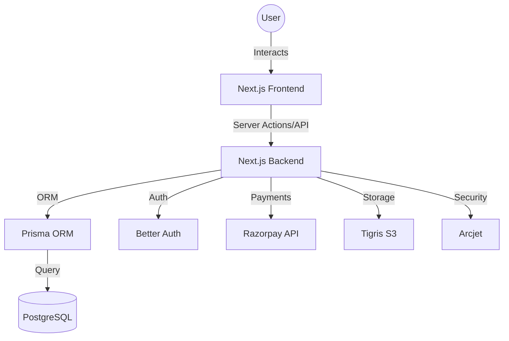

# Technical Documentation: Udayam AI Labs Dashboard

## 1. Project Overview
The **Udayam AI Labs Dashboard** is a robust Learning Management System (LMS) platform designed for managing courses, tracking user progress, and handling secure payments. It provides an administrative interface for course creation and a user-centric dashboard for learners.

## 2. Tech Stack
- **Framework**: [Next.js 16+](https://nextjs.org/) (App Router)
- **Language**: [TypeScript](https://www.typescriptlang.org/)
- **Database**: [PostgreSQL](https://www.postgresql.org/) (via [Neon](https://neon.tech/))
- **ORM**: [Prisma](https://www.prisma.io/)
- **Authentication**: [Better Auth](https://www.better-auth.com/) (Google OAuth, Email OTP, Admin Plugin)
- **Payments**: [Razorpay](https://razorpay.com/)
- **Storage**: [Tigris](https://www.tigrisdata.com/) (S3-compatible storage)
- **Email**: [Resend](https://resend.com/)
- **Security**: [Arcjet](https://arcjet.com/) (Rate limiting, Bot protection)
- **UI/UX**:
  - [shadcn/ui](https://ui.shadcn.com/) (Component library)
  - [Tailwind CSS 4](https://tailwindcss.com/)
  - [Radix UI](https://www.radix-ui.com/) (Headless components)
  - [Lucide React](https://lucide.dev/) (Icons)
  - [dnd-kit](https://dndkit.com/) (Drag and drop for reordering)
  - [Tiptap](https://tiptap.dev/) (Rich text editor)
  - [Recharts](https://recharts.org/) (Data visualization)

## 3. Architecture
The project follows the Next.js App Router architecture:
- **`app/`**: Contains all routes, layouts, and API endpoints.
  - **`(auth)`**: Authentication-related pages (Login, Signup).
  - **`(public-pages)`**: Publicly accessible pages like course listings and payment status.
  - **`admin/`**: Administrative dashboard for course and user management.
  - **`dashboard/`**: User-specific dashboard for enrolled courses and progress.
  - **`api/`**: Backend API routes (Auth, Razorpay, S3).
- **`components/`**: Reusable UI components built with shadcn/ui.
- **`lib/`**: Shared utilities, database clients, and configuration.
- **`prisma/`**: Database schema and migrations.

## 4. Detailed Architecture

### 4.1 System Overview
The application is built as a full-stack Next.js application, leveraging server-side rendering (SSR) and client-side interactivity.

### 4.2 Key Workflows

#### A. Course Enrollment & Payment Flow
1. **User** clicks "Enroll Now" on a course page.
2. **Frontend** calls `/api/razorpay/create-order` to generate a Razorpay Order ID.
3. **Razorpay Checkout** modal opens; user completes payment.
4. **Razorpay** returns a payment signature.
5. **Frontend** calls `/api/razorpay/verify-payment` with the signature.
6. **Backend** verifies the signature and updates the `Enrollment` status to `Active` in the database.
7. **Webhook**: Razorpay sends a webhook to `/api/razorpay/webhook` for asynchronous updates.

#### B. File Upload Flow (Admin)
1. **Admin** selects a file in the `Uploader` component.
2. **Frontend** calls `/api/s3/upload` with file metadata.
3. **Backend** (protected by **Arcjet** and **requireAdmin**) generates a **Presigned URL** from **Tigris**.
4. **Frontend** uploads the file directly to **Tigris** using the Presigned URL.
5. **Frontend** saves the returned `fileKey` in the course/lesson form.

#### C. Authentication Flow
- **Better Auth** handles session management using a Prisma adapter.
- **Social Login**: Redirects to Google; on success, creates/updates a user in the `user` table.
- **Email OTP**: Sends a code via **Resend**; verifies and creates a session.
- **Admin Access**: Protected by the `admin()` plugin and `requireAdmin` helper.

### 4.3 Security Architecture
- **Arcjet**: Implemented at the API layer to provide:
  - **Rate Limiting**: Prevents abuse of sensitive endpoints (e.g., file uploads, payment creation).
  - **Bot Protection**: Filters out malicious automated traffic.
- **Role-Based Access Control (RBAC)**: Admin routes are protected to ensure only authorized users can manage courses.

## 5. Database Schema
The database is managed via Prisma. Key models include:
- **`User`**: Stores user profiles, roles (Admin/User), and account status.
- **`Course`**: Contains course details (title, price, slug, status).
- **`Chapter`**: Groups lessons within a course.
- **`Lesson`**: Individual learning units with video/thumbnail keys.
- **`Enrollment`**: Tracks user purchases and enrollment status (Pending, Active, Cancelled).
- **`LessonProgress`**: Tracks which lessons a user has completed.
- **`Session` / `Account` / `Verification`**: Managed by Better Auth for session handling and social logins.

## 6. Authentication
Authentication is powered by **Better Auth**:
- **Social Login**: Google OAuth integration.
- **Email OTP**: Secure login via One-Time Passwords sent through Resend.
- **Admin Plugin**: Role-based access control to protect administrative routes.
- **Client-side**: Managed via `lib/auth-client.ts`.
- **Server-side**: Managed via `lib/auth.ts`.

## 7. Payment Integration
**Razorpay** handles all financial transactions:
1. **Order Creation**: `app/api/razorpay/create-order/route.ts` generates a Razorpay order.
2. **Payment Verification**: `app/api/razorpay/verify-payment/route.ts` validates the payment signature.
3. **Webhook**: `app/api/razorpay/webhook/route.ts` listens for asynchronous payment events to update enrollment status.

## 8. Storage
**Tigris** (via AWS S3 SDK) is used for storing:
- Course thumbnails.
- Lesson videos.
Presigned URLs are used for secure uploads and downloads (`app/api/s3`).

## 9. Key Features
- **Course Management**: Admins can create, edit, and publish courses with multiple chapters and lessons.
- **Drag & Drop Reordering**: Uses **dnd-kit** to allow admins to reorder chapters and lessons easily.
- **Rich Text Editing**: Tiptap integration for course descriptions and lesson content.
- **Progress Tracking**: Users can mark lessons as complete, and their progress is visualized in the dashboard.
- **Responsive Design**: Fully responsive UI built with Tailwind CSS.
- **File Upload Limits**:
  - **Images**: Maximum 5MB (course thumbnails and lesson thumbnail).
  - **Videos**: Maximum 5GB (lesson video).
- **Security**: Arcjet integration provides protection against common web threats and rate limiting.

## 10. Environment Variables
The following environment variables are required for the application to function:

### Database
- `DATABASE_URL`: PostgreSQL connection string.

### Authentication
- `BETTER_AUTH_SECRET`: Secret key for session signing.
- `BETTER_AUTH_URL`: Base URL for authentication.
- `AUTH_GOOGLE_CLIENT_ID`: Google OAuth Client ID.
- `AUTH_GOOGLE_CLIENT_SECRET`: Google OAuth Client Secret.

### Services
- `RESENT_EMAIL_API_KEY`: API key for Resend email service.
- `ARCJET_KEY`: API key for Arcjet security.

### AWS S3
- `AWS_ACCESS_KEY_ID`: AWS access key.
- `AWS_SECRET_ACCESS_KEY`: AWS secret key.
- `AWS_REGION`: AWS region (e.g., `ap-south-1`).
- `AWS_ENDPOINT_URL_S3`: S3 endpoint URL.
- `NEXT_PUBLIC_S3_BUCKET_NAME_IMAGES`: Public bucket name for images.

### Razorpay
- `NEXT_PUBLIC_RAZORPAY_KEY_ID`: Razorpay Public Key ID.
- `RAZORPAY_KEY_SECRET`: Razorpay Secret Key.
- `RAZORPAY_WEBHOOK_SECRET`: Secret for verifying webhook signatures.

## 11. Getting Started
1. Clone the repository.
2. Install dependencies: `npm install`.
3. Set up the `.env` file with the required variables.
4. Push the database schema: `npx prisma db push`.
5. Run the development server: `npm run dev`.
